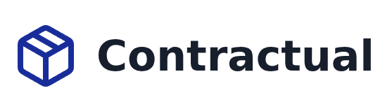

<div align="center">
    
</div>

---

<div align="center">

**Contractual** is a self-hosted project management tool built for contractors.
Quote smarter, track costs, and close jobs — without the subscription fee.

</div>

- **Material tracking** — Compare prices across stores and always know your true costs.
- **Professional invoicing** — Generate polished XLSX or PDF invoices in one click.
- **Client management** — Keep a full record of clients and their project history.
- **Self-hosted** — Your data stays yours. Deploy with a single Docker image.

## Deploy

```yml
services:
  db:
    image: postgres:18-alpine
    profiles: ["postgres"]
    environment:
      POSTGRES_DB: contractual
      POSTGRES_USER: contractual
      # Set a secure password
      POSTGRES_PASSWORD: change-me
    volumes:
      - pgdata:/var/lib/postgresql/data
    healthcheck:
      test: ["CMD-SHELL", "pg_isready -U $$POSTGRES_USER -d $$POSTGRES_DB"]
      interval: 5s
      timeout: 5s
      retries: 10

  app:
    image: ghcr.io/mfplinta/contractual:latest
    ports:
      - "80:80" # Set left-hand side to desired port in host
    environment:
      # Required on first run: credentials for the initial admin user.
      # Ignored once a user already exists in the database.
      DJANGO_SUPERUSER_USERNAME: admin
      DJANGO_SUPERUSER_PASSWORD: change-me
      # If omitted, a key is auto-generated and persisted to the data volume.
      # SECRET_KEY: change-me
      # Enable for descriptive error pages
      DEBUG: False
      # Optional: omit for SQLite, or set to a PostgreSQL connection string.
      # DATABASE_URL: postgresql://user:pass@db:5432/contractual
      # Optional: comma-separated lists of allowed hostnames. Defaults to *.
      # ALLOWED_HOSTS: example.com
      # CSRF_TRUSTED_ORIGINS: https://example.com
    volumes:
      - data:/app/data

volumes:
  pgdata:
  data:
```

## Build

Use Dev Containers in VS Code.

## License

This project is licensed under the **GNU General Public License v3.0** with modifications. See [LICENSE.md](LICENSE.md) for the full terms.

For commercial licensing inquiries or exceptions, contact [me@plinta.dev](mailto:me@plinta.dev).